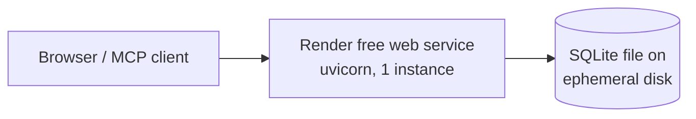
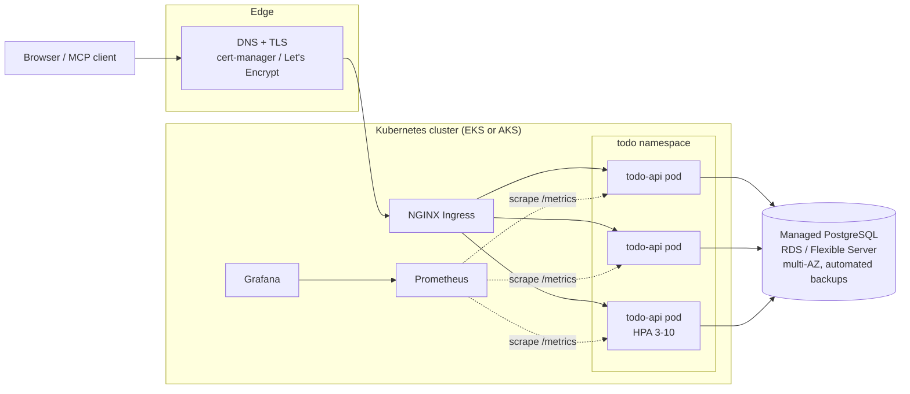
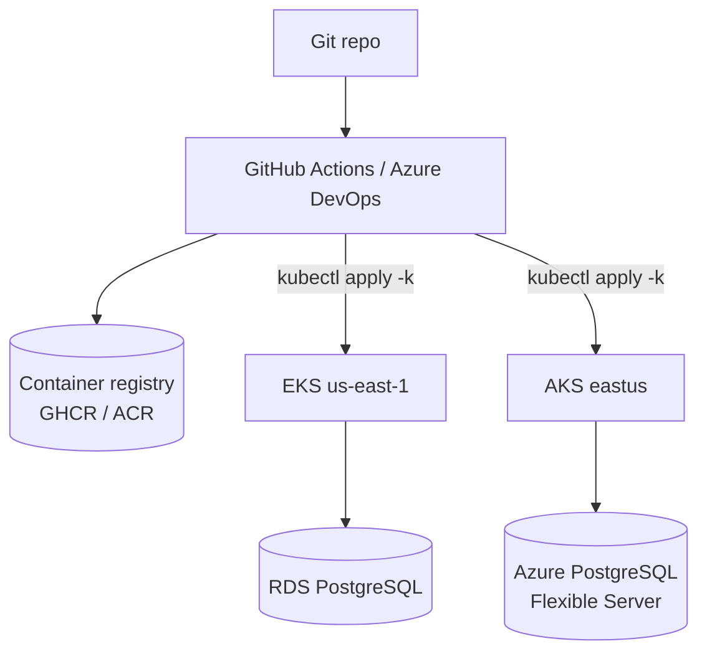

# Infrastructure architecture

## The application

A single stateless FastAPI service that serves three surfaces from one process:

- **REST API** — CRUD at `/todos` (see `main.py`)
- **MCP server** — the same five operations exposed as MCP tools via `fastapi-mcp` at `/mcp`
- **Static SPA** — vanilla JS frontend served from `/` and `/static`

State lives entirely in the database. The app defaults to a local SQLite file
and switches to PostgreSQL when `DATABASE_URL` is set — that single decision is
what makes horizontal scaling possible.

## Current state (before this work)

Problems: the SQLite file is wiped on every deploy/restart (ephemeral
filesystem), a single instance means downtime on every deploy, no health
checks, no metrics, no tests, no rollback story.

## Target state

Key properties:

| Concern | Mechanism |
| --- | --- |
| Zero-downtime deploys | RollingUpdate with `maxUnavailable: 0`, readiness gate on `/ready` |
| Self-healing | Liveness probe on `/health` restarts wedged pods |
| Scaling | HPA on CPU/memory (3→10 pods prod); cluster autoscaler on nodes |
| Availability | ≥3 replicas spread across zones, PDB `minAvailable: 2`, multi-AZ DB |
| Data durability | Managed PostgreSQL with automated backups (14 days prod) and PITR |
| Secrets | Cloud secret manager (Secrets Manager / Key Vault), synced into K8s |
| Rollback | Immutable image tags per commit; `kubectl rollout undo` + CI auto-rollback |

## Multi-cloud topology

The same container and the same kustomize overlays deploy to either cloud;
only the Terraform root differs.

Multi-cloud is active/passive by default: one cloud serves traffic, the other
is a warm standby reachable by flipping DNS. Going active/active would require
a cross-cloud database strategy (e.g. read replicas or a distributed SQL
engine) — out of scope for this app's write volume.

## Environments

| Environment | Trigger | Cluster/namespace | Replicas | Database |
| --- | --- | --- | --- | --- |
| Local | `docker compose up` | — | 1 | Postgres container |
| Staging | merge to `main` | `todo-staging` | 1 | Small single-AZ instance |
| Production | git tag `v*.*.*` + approval | `todo-prod` | 3–10 (HPA) | Multi-AZ, 14-day backups |

## Simpler fallback paths

Not every deployment needs Kubernetes. Both are fully supported by this repo:

1. **Single VM with Docker** — `ansible/site.yml` installs Docker, renders a
   compose file, pulls the image, and health-checks it. Good for a cheap
   always-on box behind Caddy/NGINX.
2. **Render (current)** — keep `render.yaml`, but set `DATABASE_URL` to a
   managed Postgres instance so data survives restarts, and upgrade off the
   free plan to avoid cold starts.
