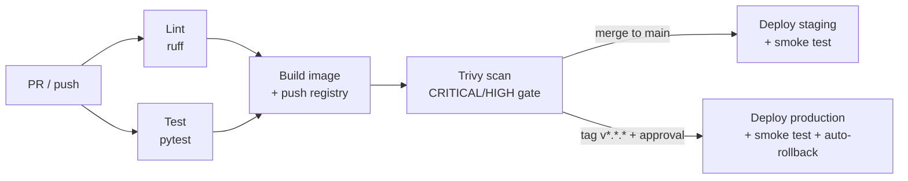

# CI/CD pipelines

Two equivalent pipelines are provided; use whichever platform hosts the repo.
Both implement the same flow:



Principles:

- **Immutable tags** — every image is tagged with the commit SHA; `latest` is
  a convenience alias only, never what gets deployed.
- **Build once, promote** — production deploys the exact image that passed
  staging, not a rebuild.
- **Gates** — vulnerability scan blocks on unfixed CRITICAL/HIGH; production
  requires a human approval on the environment.
- **Fail safe** — production job runs `kubectl rollout status` and
  `rollout undo` on failure (GitHub flow).

## GitHub Actions — `.github/workflows/ci-cd.yml`

| Job | Runs on | Notes |
| --- | --- | --- |
| `lint` | every PR/push | `ruff check .` |
| `test` | every PR/push | `pytest tests/` |
| `build` | after lint+test | Buildx, GHCR, tags: `<sha>`, `latest` (main), semver (tags) |
| `scan` | pushes only | Trivy, fails on CRITICAL/HIGH |
| `deploy-staging` | push to `main` | kustomize overlay `staging`, waits for rollout, in-cluster smoke test |
| `deploy-production` | tag `v*.*.*` | environment `production` (approval), rollback on failure |

Required repo configuration:

- **Secrets**: `STAGING_KUBECONFIG`, `PROD_KUBECONFIG` (base64-encoded kubeconfigs
  for scoped service accounts — not cluster-admin).
- **Environments**: `staging`, `production` — add required reviewers on
  `production`.
- Replace `ghcr.io/OWNER/...` placeholders in `k8s/overlays/*/kustomization.yaml`
  and `k8s/base/deployment.yaml` with the real org/repo.

## Azure DevOps — `azure-pipelines.yml`

Stages: `Verify` (lint + test with published JUnit results) → `Build`
(Docker@2 to ACR + Trivy) → `DeployStaging` (main) → `DeployProduction` (tags).

Required project configuration:

- **Service connections**: `acr-connection` (registry), `aks-staging`,
  `aks-production` (Kubernetes).
- **Environments**: `staging`, `production` — add an Approvals check on
  `production`.
- Set the `containerRegistry` variable to the real ACR login server.

## Rollback playbook

```bash
# Fastest: revert to the previous ReplicaSet
kubectl -n todo-prod rollout undo deployment/todo-api

# Targeted: redeploy a known-good image tag
cd k8s/overlays/production
kustomize edit set image ghcr.io/OWNER/fastapi-mcp-todo=ghcr.io/OWNER/fastapi-mcp-todo:<good-sha>
kubectl apply -k .
```

Because tags are commit SHAs, "what is running" is always answerable:
`kubectl -n todo-prod get deploy todo-api -o jsonpath='{.spec.template.spec.containers[0].image}'`.
